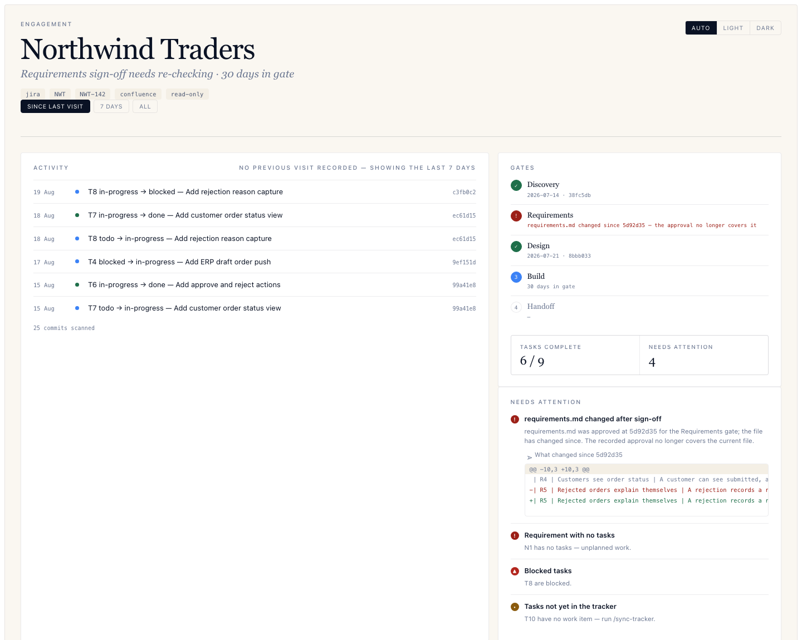
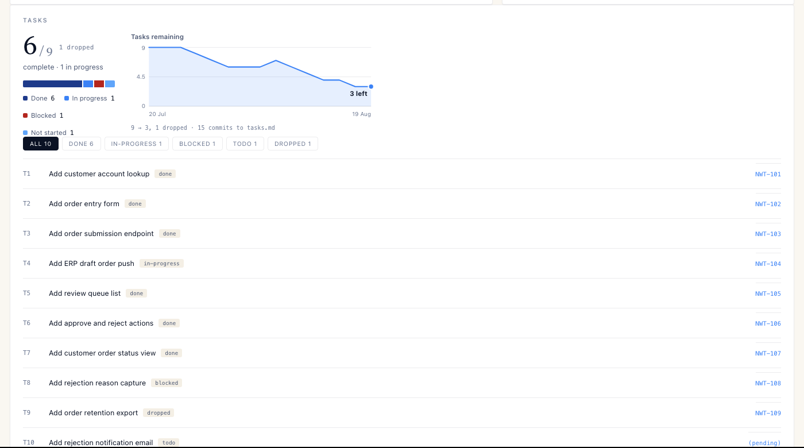
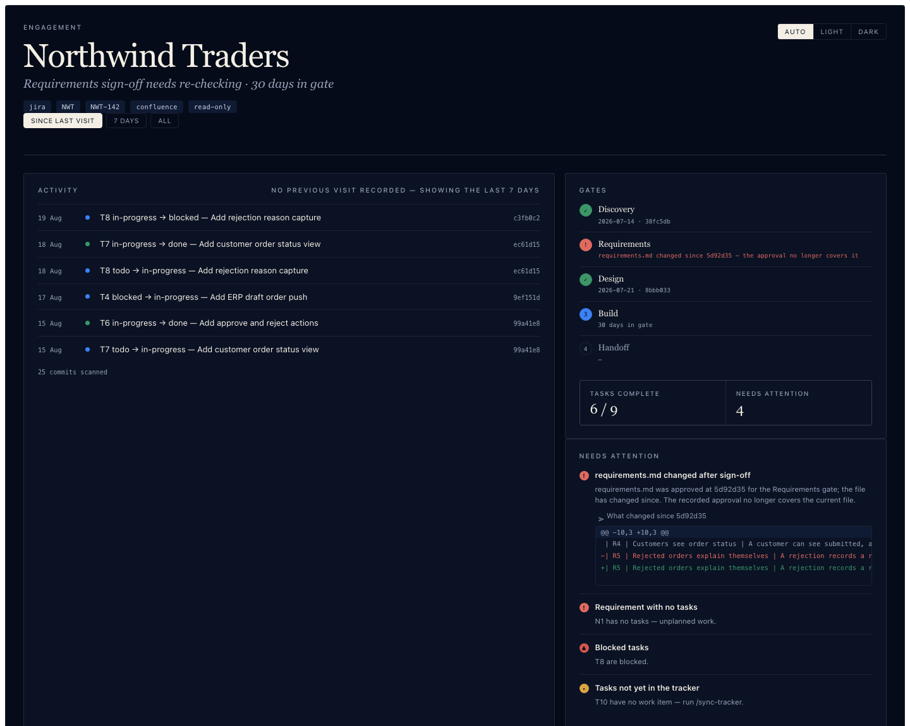

# Greenfield Delivery

A Claude Code plugin encoding a greenfield delivery methodology:
spec-driven engagement gates with client sign-off, tracker integration
(Jira / Azure DevOps), and business-user progress reporting.

## Install

```
/plugin marketplace add Abhisrajput/greenfield-delivery
/plugin install greenfield
```

Once per person. Nothing here is client-specific — the methodology is the
product, and engagement data never leaves the client's own repository. Every
artifact a gate produces lives in that repository under `docs/engagement/`, and
`/dashboard` runs on loopback against it.

Available afterwards in the terminal CLI, the VS Code
extension, JetBrains, and the desktop app — they are surfaces on the same
Claude Code installation.

Updates are `git pull` on the marketplace. There is no build step.

## See it working

```
./examples/make-sample.sh /tmp/northwind
python3 -u scripts/dashboard --root /tmp/northwind
```



Every row in that feed is derived from a commit. The finding at the top right —
*requirements.md changed after sign-off* — is the one the methodology exists to
produce: a requirement moved after the client approved it, which is a change
order rather than a surprise at handover.

It expands to show **exactly which line moved** between the approved commit and
now. That is the question a drift warning raises, and answering it is the whole
point of recording approval against a SHA rather than against a date.



T9 is `dropped`, not deleted, so the denominator still tells the truth: 6 of 9,
one dropped. Deleting the row would have shown 6 of 8 and made completion jump
with nothing recording that scope was cut.

The dashboard follows the system theme, and the toggle overrides it:



That builds a fictional engagement as a real git repository and opens
the read-only dashboard against it. The engagement is deliberately untidy in
the ways real ones are: a requirement whose acceptance criterion moved after
its gate was signed, a blocked task, a dropped task that leaves a signed
requirement with no coverage, and work that has not reached the tracker yet.

The activity feed is derived entirely from that repository's commit history —
which is why the sample is a script and not a folder of finished files.

## What installing this adds

Worth knowing before you install, rather than discovering later:

| | |
|---|---|
| 13 skills, 10 commands, 2 subagents | markdown; no build step |
| `scripts/` | python3 **standard library only** — no pip, no npm, no CDN |
| An Atlassian MCP server declaration | inert until you authorize it |

That last one deserves a straight answer. `.mcp.json` declares Atlassian's
hosted MCP endpoint plugin-wide, so it appears in `/mcp` for everyone —
including people using Azure DevOps or no tracker at all. **Declaring a server
does not connect to it**: it sits unauthenticated and does nothing until you
run the OAuth flow yourself. Nothing is sent anywhere until you authorize, and
each person authorizes individually.

It is plugin-wide because it can be: the Atlassian site comes from your
authorization rather than the URL, so one endpoint serves every engagement. The
Azure DevOps server takes the organization as a required argument, so it cannot
be — `/new-engagement` writes that one into the client repository instead.

If you would rather not have it declared at all, delete `.mcp.json`. Only the
Jira path depends on it.

## The methodology in one page

Five gates. Each produces a durable artifact, each requires recorded client
approval, and nothing proceeds until the previous approval is recorded with the
commit SHA of what was approved.

| Gate | Artifact | Client action |
|---|---|---|
| 0. Discovery *(optional)* | `discovery.md` | Agrees problem and commercial shape |
| 1. Requirements | `requirements.md` | 👍 — **scope baseline** |
| 2. Design | `design.md`, `CLAUDE.md`, `AGENTS.md`, `tasks.md`, `test-cases.md` | 👍 — architecture agreed |
| 3. Build | working software; `tasks.md` worked down | Demos, visible progress |
| 4. Handoff | README, runbook, delivery record | Acceptance |

The commercial point of gate 1: approved requirements convert "the AI built the
wrong thing" from your problem into a signed-off change order.

The technical point of gate 2: `CLAUDE.md` is what makes generic agents build
things your way, which is how the methodology reaches unattended work without
any orchestration infrastructure.

The practical point of gate 3: writing the code is now the cheap part.
`build-loop` covers the expensive parts — verifying by driving the product
rather than by trusting a green suite, and reviewing agent-written code, which
fails differently from human code. It is where most of an engagement's hours go
and where the failures that reach a client are made.

## Commands

| Command | Does |
|---|---|
| `/new-engagement` | Scaffold `docs/engagement/`, capture tracker and reporting config |
| `/gate <name>` | Run a gate end to end, including the sign-off record |
| `/approve <gate>` | Draft an approval request, or record an approval that arrived |
| `/sync-tracker` | Push `tasks.md` to the tracker; pull status back |
| `/status-report` | Regenerate the client-facing status page |
| `/import-artifact` | Bring a document you already have in as a gate artifact |
| `/conform` | Check the engagement record against the rules |
| `/qe` | Generate Gherkin from the test cases, or read run results back |
| `/handoff` | Assemble the delivery package |
| `/dashboard` | Serve a read-only local view of engagement state |

## How a requirement becomes a ticket

The question everyone asks first:

```
conversations, transcripts, the client's own doc
      ↓  accumulate over days — nothing approved yet
requirements.md      R1, R2, N1 …        ← the gate signs THIS, at a commit
      ↓  broken down at the Design gate
tasks.md             T1 → R1, T2 → R1 …
      ↓  /sync-tracker
Jira    epic → one story per REQUIREMENT → one subtask per TASK
      ↓  real keys written back into tasks.md
```

**Gathering is incremental; approval is a moment.** `requirements.md` grows
across every conversation, and the gate is where you stop and ask. A requirement
that arrives later is an amendment — change it, take it to the client, append a
second sign-off row. The original stays, so the record shows scope moved.

**Requirements are not tasks, and the gap is deliberate.** Nothing turns R1 into
tickets automatically: breaking a requirement into work is a design decision, and
it happens after the client agreed what is being built.

[docs/USAGE.md](docs/USAGE.md) has the worked version, including what to do with
a meeting transcript — which is extraction, not import, because a conversation
contains decisions, half-decisions and things somebody said to be polite.

## Using it

[docs/USAGE.md](docs/USAGE.md) walks one engagement from `/new-engagement` to
handoff, including what to do when the client already has a requirements
document — which is most of the time. `/import-artifact` converts an existing
document to the canonical format, keeps the author's wording, and reports what
it does not yet commit to, rather than pretending the gate produced it.

## What is actually verified

```
/conform
```

checks the engagement record against the rules the methodology states: gates
signed in order, sign-off commits that exist, approved artifacts unchanged since
approval, unique identifiers, every task pointing at a requirement that exists,
every in-scope requirement covered by a business test case someone can actually
run, and — where a team keeps one — every recorded decision carrying the reason
it was made.

It reports three outcomes, and the third is not the second: `PASS`, `FAIL`, and
`skip` for a rule that **could not** be checked. A new engagement skips nearly
everything, which is correct — anything that grades an empty engagement as
compliant is lying to you.

`examples/conformance/` holds an engagement per rule, each breaking exactly one,
so the checker is shown to discriminate rather than merely to run. `check.sh`
fails if any fixture stops failing its rule.

**What this does not do.** It does not evaluate the quality of anyone's
judgment, and it cannot tell whether a requirement is the right requirement. An
engagement can pass every rule and still be badly run. The test suite tests the
dashboard and the checker — not the methodology, and not the model's output. If
someone asks whether there is an eval, that is the honest answer: the record is
verified, the reasoning is not.

## Trackers

| | Atlassian | Azure DevOps |
|---|---|---|
| Work tracking | Jira | Azure Boards |
| Status page | Confluence | ADO Wiki |
| Dashboard | Jira dashboard | ADO Dashboards |
| **Unattended ticket → PR** | **Claude Agent for Jira** *(see below)* | **none** |

> ⚠️ **The unattended tier is the one claim here that has not been observed
> working.** It needs the Claude app installed on the client's Jira site — a
> site-admin action, and on a client-owned site their decision — and handing
> work to it appears to require a person clicking in the Jira UI: setting the
> assignee through the REST API left the item untouched. Treat it as a
> possibility to confirm with the client rather than a capability to price.
> `skills/tracker-jira/SKILL.md` has what was actually observed.

> ⚠️ **Azure DevOps engagements have no unattended tier** — the build phase is
> entirely attended, which is more hands-on time than an equivalent Atlassian
> engagement. Account for it at Discovery. See
> `skills/tracker-azure-devops/SKILL.md`.

> ⚠️ **The Azure DevOps path has never been run.** The Atlassian path has —
> a full engagement, see [the field report](docs/2026-08-20-live-run.md). The
> ADO skill is researched from Microsoft's documentation and the MCP server's
> interface, and its procedures have not been executed once. It opens with a
> twenty-minute pre-flight to run on a scratch project **before** committing an
> engagement to it. If you take that path you are the first, and corrections
> belong back in the skill.

Core skills are tracker-agnostic; specifics live in `tracker-jira` and
`tracker-azure-devops`. Adding a third tracker is one new markdown file.

## Design principle

Own the methodology, rent everything else. Skills are markdown; the harness,
the trackers, and the agents are vendor-maintained. There is no fork to
rebase and no dependency tree. The one exception is `/dashboard`, an
internal-only view that runs on localhost from the Python standard library —
nothing is hosted for the client, and the client-facing status page is still
projected into Confluence or the ADO Wiki.

The one recurring cost is prompt re-tuning when a new model ships — budget a
re-read of the skills per release.

## Status

**Usable on an Atlassian engagement.** All five gates, sign-off recording,
tracker conventions, progress reporting, build standards, and handoff are
complete.

Two things outstanding:

1. **Azure DevOps needs per-machine setup.** Node.js 20+ and a one-time
   browser login. The MCP server is configured per client project by
   `/new-engagement`, not plugin-wide, because it takes the organization as an
   argument. Microsoft's hosted remote server **cannot** be used — Claude Code
   can't authenticate to it. See `skills/tracker-azure-devops/SKILL.md`.
2. **The "Do not" list in `build-standards` is seeded, not complete.** It
   carries the universal handover traps. It should grow as engagements teach
   you things — this is the section that compounds across engagements.

### What is verified, and what is not

Being precise about this, because "tested" means different things and the
difference matters when you are deciding whether to run it on a client.

**Verified.** The tooling: over 300 tests over the parsers, the dashboard, the
conformance checker and the Gherkin pipeline, with the load-bearing ones each
demonstrated to fail against a deliberately broken build. The formats the
skills *teach* are checked against the parser that *reads* them, so the
documentation cannot drift from the code without `check.sh` failing. The
conformance fixtures each break exactly one rule and are checked to break
nothing else. The sample engagement in `examples/` is built and parsed on every
run.

**Run against live Atlassian, once.** A full engagement was taken from
`/new-engagement` to handoff against a real Jira and Confluence site on
2026-08-20: an epic, seven stories and eight sub-tasks created; the real issue
keys written back into `tasks.md`; issues transitioned in Jira and their status
pulled back; and a client-facing status page published to Confluence. It found
three defects, which are fixed — see [the field report](docs/2026-08-20-live-run.md).

**Not verified.** The whole Azure DevOps path — never run, not once. Whether
an agent following these skills produces good work.
The skills are instructions; that run was a person following them, not a model
executing them unattended. No Azure DevOps engagement has been run at all. And
the gates are **detected, not enforced**: git will accept a sign-off written by
hand that skips three gates, and only `/conform` catches it afterwards.

So: run `/new-engagement` on a scratch repository and walk it through before
using it on a client, and put `.github/workflows/conformance.yml` in the client
repo so the checks run without anyone remembering.

## Licence

MIT — see [LICENSE](LICENSE). The methodology is meant to be taken and adapted;
attribution is the only condition.

Contributions are welcome. [CONTRIBUTING.md](CONTRIBUTING.md) lists the
constraints that keep this cheap to own — markdown-only skills, a stdlib-only
dashboard, and the rule that a test must be shown to fail before it is trusted.
